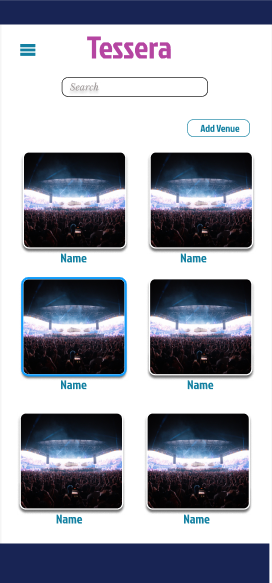
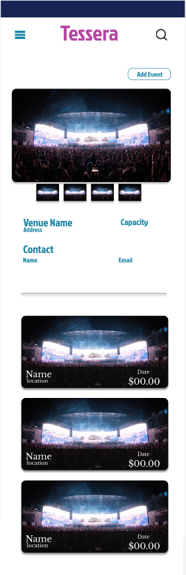
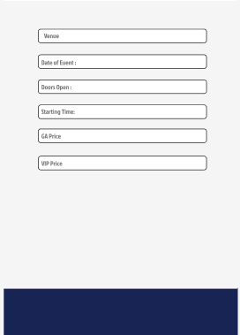
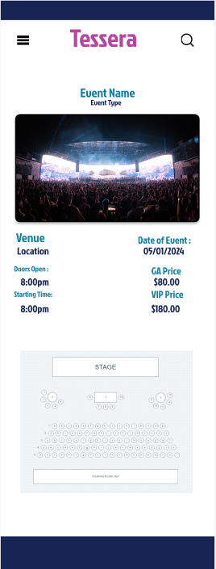

# Tessera

An app to find cool events at the hottest venues in New York City.

## Frontend

The app's frontend is created using React and is set up with a simple flow of pages as shown below:


In order to retrieve from and post to the backend server, the app uses axios calls to the backend.

```js
useEffect(() => {
        const getEvent = async() => {
            const response = await axios.get(`http://localhost:8000/events/${id}`)
            setEvent(response.data)
        }
        getEvent()
    }, [])

    useEffect(() => {
        const getVenue = async() => {
            const response = await axios.get(event.venue)
            setVenue(response.data)
        }
        if (event) {
            getVenue()
        }
    }, [event])
```

All the venues are displayed on the landing page and clicking on a venue card will lead to the venue's page.



This page in turn displays data about the venue as well as upcoming events at that venue. Additional events at that venue can be added on this page.

 

Finally, clicking on an event card will lead to the event page, which displays details about that event.



## Backend

The app uses Django for the backend with a PostgreSQL database hosted on Amazon's Relational Database Services. The backend is made up of two models: venues and events.


Both models have full CRUD as well as index and show routes. The venue routes are set up so that the events details are nested within the venue details to enable easy access of information on the frontend.

```python
class EventSerializer(serializers.HyperlinkedModelSerializer):
    venue = serializers.HyperlinkedRelatedField(
        view_name='venue_detail',
        read_only=True
    )
    venue_id = serializers.PrimaryKeyRelatedField(
        queryset=Venue.objects.all(),
        source='venue'
    )
    class Meta:
       model = Event
       fields = ('id','venue', 'venue_id', 'name', 'venue_type', 'date', 'door_time', 'start_time', 'ga_price', 'vip_price', 'image_url')

class VenueSerializer(serializers.HyperlinkedModelSerializer):
    events = EventSerializer (
        many=True,
        read_only=True
    )
    venue_url = serializers.ModelSerializer.serializer_url_field(
        view_name='venue_detail'
    )
    class Meta:
       model = Venue
       fields = ('id','name', 'venue_url', 'address', 'capacity', 'poc_name', 'poc_email','image_url', 'events')
    
```